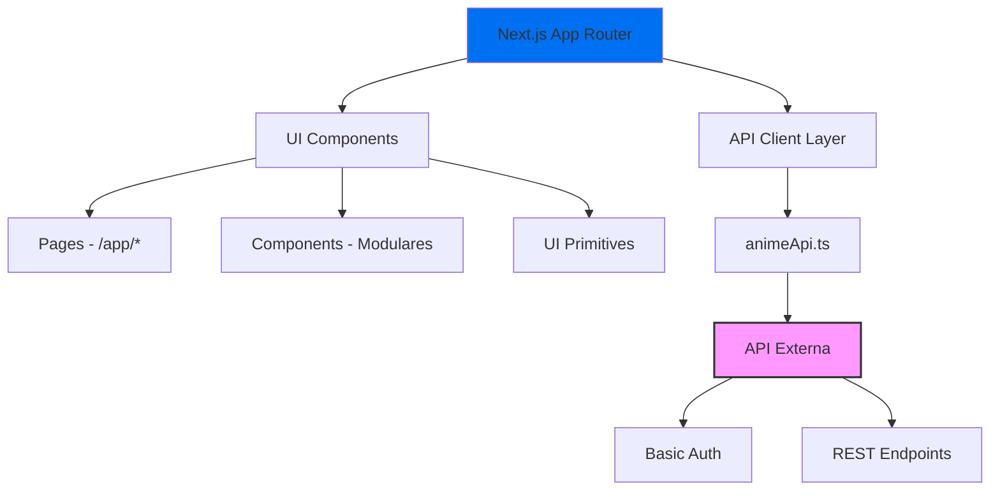

# Anime List Organizer

## Sistema de Gerenciamento de Animes - Frontend v2.0.0

[](https://opensource.org/licenses/MIT)
[](https://github.com/GabrielFinotti/anime-list-organizer-app)
[](https://github.com/GabrielFinotti/anime-list-organizer-app/releases)

**Framework & Tecnologias:**

[](https://nextjs.org/)
[](https://reactjs.org/)
[](https://www.typescriptlang.org/)
[](https://sass-lang.com/)

**Requisitos & Suporte:**

[](https://nodejs.org/)
[](https://developers.google.com/web/fundamentals/design-and-ux/responsive)
[](https://web.dev/progressive-web-apps/)

---

*Aplicação frontend para organização e acompanhamento estruturado de animes. Interface otimizada para mobile-first com preparação para expansão desktop e recursos PWA.*

## 📋 Índice

- [📌 Visão Geral](#-visão-geral)
- [⚡ Features Principais](#-features-principais)
- [🏗️ Arquitetura](#-arquitetura)
- [📁 Estrutura do Projeto](#-estrutura-do-projeto)
- [🚀 Quick Start](#-quick-start)
- [🔧 Configuração](#-configuração)
- [🌐 Integração com API](#-integração-com-api)
- [📱 Funcionalidades](#-funcionalidades)
- [🧪 Qualidade e Testes](#-qualidade-e-testes)
- [🛣️ Roadmap](#-roadmap)
- [🤝 Contribuição](#-contribuição)
- [📄 Licença](#-licença)

---

---

## 📌 Visão Geral

O **Anime List Organizer** é uma aplicação frontend especializada no gerenciamento e acompanhamento de animes. Esta versão 2.0.0 representa uma refatoração completa focada em:

- **Separação de responsabilidades**: Frontend isolado consumindo API externa
- **Mobile-first design**: Interface otimizada para dispositivos móveis
- **Modularização**: Componentes reutilizáveis e arquitetura escalável
- **Performance**: Next.js 15 + Turbopack para desenvolvimento rápido

### 🎯 Objetivos Principais

- Centralizar gerenciamento de coleção de animes
- Acompanhar progresso de temporadas e episódios
- Diferenciação inteligente entre filmes e séries
- Enriquecimento automático de metadados via lookup AI
- Preparação para recursos PWA e suporte desktop

## ⚡ Features Principais

### 📊 Gestão de Dados

| Feature | Descrição | Status |
|---------|-----------|--------|
| **CRUD Completo** | Criar, listar, editar e deletar animes | ✅ Ativo |
| **Busca em Tempo Real** | Filtro instantâneo via `useMemo` (client-side) | ✅ Ativo |
| **Lookup AI** | Enriquecimento automático de metadados | ✅ Ativo |
| **Categorização** | Gêneros, demografia, origem | ✅ Ativo |
| **Progresso Tracking** | Temporadas/episódios assistidos | ✅ Ativo |

### 🎨 Interface & UX

| Feature | Descrição | Status |
|---------|-----------|--------|
| **Mobile-First** | Design responsivo otimizado para mobile | ✅ Ativo |
| **Formulários Modulares** | Componentes reutilizáveis de entrada | ✅ Ativo |
| **SASS Modules** | Estilização isolada e maintível | ✅ Ativo |
| **Cards Interativos** | Interface visual para listagem | ✅ Ativo |

### 🔧 Performance & Dev

| Feature | Descrição | Status |
|---------|-----------|--------|
| **Turbopack** | Build e HMR ultrarrápidos | ✅ Ativo |
| **TypeScript** | Type safety completo | ✅ Ativo |
| **App Router** | Next.js 15 com roteamento moderno | ✅ Ativo |

## 🏗️ Arquitetura

### Visão Alto Nível



### Stack Tecnológico

```text
┌─ Frontend (Este Repo)
│  ├─ Next.js 15.5.2 (App Router)
│  ├─ React 19.1.0 (Client Components)
│  ├─ TypeScript 5.x (Type Safety)
│  ├─ SASS Modules (Styling)
│  └─ Fetch API (HTTP Client)
│
└─ Backend (Repositório Separado)
   ├─ API REST
   ├─ Autenticação Basic Auth
   ├─ Endpoints: animes, categorias, gêneros
   └─ Integração Lookup AI
```

### Características Arquiteturais

- **Frontend Desacoplado**: Consumo via HTTP de API externa
- **Client-Side Filtering**: Busca em tempo real usando `useMemo`
- **Component-Driven**: Arquitetura modular e reutilizável
- **Mobile-First**: Design responsivo com breakpoints planejados
- **Type-Safe**: TypeScript end-to-end com DTOs

## � Estrutura do Projeto

```tree
src/
├── app/                          # Next.js App Router
│   ├── anime/                    # Domínio Anime
│   │   ├── add/                  # Formulário de criação
│   │   ├── list/                 # Listagem principal
│   │   ├── data/[id]/            # Página de detalhes
│   │   └── lookup/               # Lookup assistido
│   ├── layout.tsx                # Layout raiz
│   ├── page.tsx                  # Homepage
│   └── globals.scss              # Estilos globais
│
├── components/                   # Componentes Reutilizáveis
│   ├── layout/
│   │   ├── forms/                # Formulários
│   │   │   ├── animeForm/        # Criação/edição de anime
│   │   │   ├── animeLookupForm/  # Lookup de metadados
│   │   │   ├── searchForm/       # Busca de animes
│   │   │   └── loginForm/        # Autenticação (futuro)
│   │   ├── cards/
│   │   │   └── animeCard/        # Card de exibição
│   │   └── headers/
│   │       └── mobileHeader/     # Header mobile
│   └── ui/                       # Primitivos UI
│       ├── inputs/               # Inputs reutilizáveis
│       │   ├── defaultInput/
│       │   ├── searchInput/
│       │   ├── select/
│       │   └── checkbox/
│       └── loaders/              # Loading states
│
├── lib/                          # Lógica de Negócio
│   ├── api/
│   │   └── animeApi.ts           # Cliente HTTP API
│   └── dto/                      # Data Transfer Objects
│       ├── anime.dto.ts
│       ├── category.dto.ts
│       ├── genre.dto.ts
│       └── adultGenre.dto.ts
│
└── public/                       # Assets Estáticos
    └── icons/                    # Ícones SVG
```

### Convenções de Organização

- **Colocation**: Componentes organizados por domínio/funcionalidade
- **SASS Modules**: Um arquivo `.module.scss` por componente
- **Type Safety**: DTOs para todas as interfaces de dados
- **Atomic Design**: UI primitivos reutilizáveis em `/ui`

## 📦 Modelo (Schema Anime)

| Campo | Tipo | Obrigatório | Observações |
|-------|------|-------------|-------------|
| `name` | string | sim | Indexado |
| `synopsis` | string | não | Sinopse |
| `status` | string | não | Ex: watching, completed |
| `category` | string[] | não | Demografia (ex: shounen) |
| `genre` | string[] | não | Gêneros (ação, drama...) |
| `origin` | string[] | não | Fonte (manga, original...) |
| `namesOfOrigins` | string[] | não | Títulos originais |
| `isMovie` | boolean | não | Se é filme |
| `isSerieContentAnyMovie` | boolean | não | Série com filmes associados |
| `moviesNames` | string[] | não | Lista de filmes relacionados |
| `lastReleasedSeason` | number \| null | não | Última temporada lançada |
| `lastWatchedSeason` | number \| null | não | Progresso do usuário |
| `lastWatchedEpisode` | number \| null | não | Progresso do usuário |
| `createdAt` / `updatedAt` | Date | auto | Timestamps |

## 🔐 Variáveis de Ambiente

| Nome | Descrição | Obrigatório | Exemplo |
|------|-----------|------------|---------|
| `NEXT_PUBLIC_API_URL` | Base URL da API externa | Sim | <https://api.seudominio.com> |
| `NEXT_PUBLIC_BASIC_USERNAME` | Usuário Basic Auth para chamadas | Sim | usuario_front |
| `NEXT_PUBLIC_BASIC_PASSWORD` | Senha Basic Auth para chamadas | Sim | senha123 |

Observações:

- Credenciais expostas como `NEXT_PUBLIC_*` só são aceitáveis se a API usar permissões limitadas (ideal: trocar para fluxo de autenticação por usuário em versões futuras).
- Removidas variáveis de persistência (Mongo/OpenAI) pois pertencem agora ao repositório da API.

Arquivo recomendado: `.env.local`

Exemplo `.env.local`:

```env
NEXT_PUBLIC_API_URL=https://api.seudominio.com
NEXT_PUBLIC_BASIC_USERNAME=usuario_front
NEXT_PUBLIC_BASIC_PASSWORD=senha123
```

## ⚙️ Instalação & Execução

Pré-requisitos: Node 18+ e MongoDB (local ou Atlas).

```powershell
git clone https://github.com/GabrielFinotti/Anime-list-organizer.git
cd Anime-list-organizer
npm install
copy NUL .env.local 
npm run dev
```

App: <http://localhost:3000>

Build produção:

```powershell
npm run build
npm start
```

## 🧪 Qualidade (Sugestões Futuras)

- Testes unitários (Vitest/Jest) para normalizadores e handlers
- Testes de integração com supertest / next test runner
- ESLint + Prettier (já há lint script)
- Configuração de CI (GitHub Actions) para lint + testes + build

## 🌐 Integração com API

### Cliente HTTP

A comunicação com a API externa é centralizada em `src/lib/api/animeApi.ts`, implementando:

- **Autenticação**: Basic Auth automatizada
- **Error Handling**: Tratamento consistente de erros
- **Type Safety**: Retornos tipados com DTOs
- **Singleton Pattern**: Reutilização de configurações

### Endpoints Disponíveis

| Endpoint | Método | Descrição | Retorno |
|----------|--------|-----------|---------|
| `/animes` | GET | Lista todos os animes | `AnimeDTO[]` |
| `/animes` | POST | Cria novo anime | `AnimeDTO` |
| `/animes/:id` | GET | Busca anime por ID | `AnimeDTO` |
| `/anime/update/:id` | PUT | Atualiza anime existente | `AnimeDTO` |
| `/anime/delete/:id` | DELETE | Remove anime | `boolean` |
| `/anime/lookup?title=` | GET | Enriquecimento AI | `AnimeDTO` |
| `/categories` | GET | Lista categorias | `CategoryDTO[]` |
| `/genres` | GET | Lista gêneros | `GenreDTO[]` |
| `/adult-genres` | GET | Lista gêneros adultos | `GenreDTO[]` |

### Exemplo de Uso

```typescript
import AnimeAPI from '@/lib/api/animeApi';

// Buscar todos os animes
const animes = await AnimeAPI.getAnime();

// Buscar com filtro por nome
const filteredAnimes = await AnimeAPI.getAnime('Naruto');

// Criar novo anime
const newAnime = await AnimeAPI.createAnime({
  name: 'Attack on Titan',
  status: 'watching',
  genre: ['ação', 'drama'],
  isMovie: false
});
```

## � Funcionalidades

### 🔍 Sistema de Busca

**Implementação Client-Side com `useMemo`**

A busca funciona em tempo real, filtrando a lista de animes já carregada:

```typescript
const filteredAnimes = useMemo(() => {
  if (!searchTerm) return animes;
  
  return animes.filter(anime => 
    anime.name.toLowerCase().includes(searchTerm.toLowerCase())
  );
}, [animes, searchTerm]);
```

**Características:**

- ⚡ **Instantâneo**: Sem delay de rede
- 🔄 **Reativo**: Atualiza conforme digitação
- 📱 **Mobile-friendly**: Otimizado para touch
- 💾 **Cache-friendly**: Usa dados já carregados

### 📝 Formulários Modulares

- **AnimeForm**: Criação e edição com validação
- **SearchForm**: Busca com debounce automático
- **LookupForm**: Enriquecimento via AI
- **Inputs Reutilizáveis**: Checkbox, Select, DefaultInput

### 🎨 Interface Adaptiva

- **AnimeCard**: Cards responsivos para listagem
- **Mobile Header**: Navegação otimizada
- **Loading States**: Feedback visual consistente
- **Error Boundaries**: Tratamento elegante de erros

## � Qualidade e Testes

### Status Atual

| Área | Implementado | Planejado |
|------|-------------|-----------|
| **Linting** | ✅ ESLint + Next.js rules | Prettier integration |
| **Type Safety** | ✅ TypeScript strict | API schema validation |
| **Testes Unitários** | ❌ Não implementado | Vitest + Testing Library |
| **Testes E2E** | ❌ Não implementado | Playwright |
| **CI/CD** | ❌ Não implementado | GitHub Actions |

### Configuração de Qualidade

```json
{
  "extends": ["next/core-web-vitals"],
  "rules": {
    "prefer-const": "error",
    "no-unused-vars": "warn"
  }
}
```

### Próximos Passos

1. **Testes Unitários**: Componentes e funções utilitárias
2. **Testes de Integração**: Fluxos completos de CRUD
3. **Coverage Reports**: Metas de cobertura de código
4. **Performance Testing**: Core Web Vitals monitoring

## �️ Roadmap

### 🚀 Curto Prazo (Q1 2025)

**Design & UX**

- [ ] **Design Responsivo Desktop**
  - Breakpoints: sm(480px), md(768px), lg(1024px), xl(1280px)
  - Grid layouts adaptáveis
  - Ajustes tipográficos para telas grandes

- [ ] **Progressive Web App (PWA)**
  - Manifest com ícones multi-resolução
  - Service Worker com estratégias de cache
  - Instalação offline
  - Notificações push (opcional)

- [ ] **Acessibilidade (a11y)**
  - Roles ARIA completos
  - Navegação por teclado
  - Contraste WCAG AA
  - Screen reader optimization

### 🎯 Médio Prazo (Q2-Q3 2025)

**Funcionalidades Core**

- [ ] **Sistema de Autenticação**
  - Login/registro por usuário
  - JWT tokens
  - Sessões persistentes
  - Perfis personalizados

- [ ] **Funcionalidades Avançadas**
  - Paginação e infinite scroll
  - Filtros complexos (gênero, status, ano)
  - Sistema de tags personalizadas
  - Busca avançada com operadores

- [ ] **Produtividade**
  - Exportar/importar (JSON, CSV)
  - Backup automático
  - Sincronização entre dispositivos
  - Estatísticas de visualização

### 🔮 Longo Prazo (Q4 2025+)

**Inovação & Escalabilidade**

- [ ] **Modo Offline Completo**
  - Sincronização diferida
  - Conflict resolution
  - Background sync
  - Persistent storage

- [ ] **Internacionalização**
  - Suporte pt-BR / en-US
  - RTL languages
  - Localização de datas/números
  - Content localization

- [ ] **AI & Analytics**
  - Recomendações personalizadas
  - Analytics de progresso
  - Previsão de tempo para completion
  - Trends de consumo

### 📋 Detalhes Técnicos PWA

**Manifest Features:**

```json
{
  "name": "Anime List Organizer",
  "short_name": "AnimeList",
  "display": "standalone",
  "orientation": "portrait",
  "theme_color": "#0070f3",
  "icons": [
    { "src": "/icon-192.png", "sizes": "192x192" },
    { "src": "/icon-512.png", "sizes": "512x512" }
  ]
}
```

**Service Worker Strategy:**

- **Shell**: Cache-first (app shell, assets estáticos)
- **API Data**: Stale-while-revalidate (dados dinâmicos)
- **Images**: Cache-first com fallback
- **Offline**: Página offline customizada

## 🤝 Contribuição

### Como Contribuir

Contribuições são bem-vindas! Siga estes passos:

1. **Fork** o repositório
2. **Clone** seu fork localmente
3. **Crie** uma branch para sua feature (`git checkout -b feat/nova-feature`)
4. **Commit** suas mudanças (`git commit -m 'feat: adiciona nova feature'`)
5. **Push** para a branch (`git push origin feat/nova-feature`)
6. **Abra** um Pull Request

### Padrões de Commit

Seguimos [Conventional Commits](https://www.conventionalcommits.org/):

```bash
feat: nova funcionalidade
fix: correção de bug
docs: alterações na documentação
style: formatação, lint
refactor: refatoração de código
test: adição/correção de testes
chore: tasks de build, deps, etc
```

### Checklist para PRs

- [ ] **Build** passa (`npm run build`)
- [ ] **Lint** limpo (`npm run lint`)
- [ ] **TypeScript** sem erros
- [ ] **Testes** passando (quando implementados)
- [ ] **Documentação** atualizada
- [ ] **Screenshots** para mudanças visuais

### Issues & Bugs

- Use **templates** provided para issues
- Inclua **passos** para reproduzir
- Adicione **screenshots** quando relevante
- Marque **labels** apropriadas

### Discussões Técnicas

Para discussões sobre:

- Arquitetura e design patterns
- Escolhas tecnológicas
- Performance e otimizações
- Roadmap e features

Use [GitHub Discussions](https://github.com/GabrielFinotti/anime-list-organizer-app/discussions)

## 📄 Licença

Este projeto está licenciado sob a **MIT License**.

```text
MIT License

Copyright (c) 2025 Gabriel Finotti

Permission is hereby granted, free of charge, to any person obtaining a copy
of this software and associated documentation files (the "Software"), to deal
in the Software without restriction, including without limitation the rights
to use, copy, modify, merge, publish, distribute, sublicense, and/or sell
copies of the Software, and to permit persons to whom the Software is
furnished to do so, subject to the following conditions:

The above copyright notice and this permission notice shall be included in all
copies or substantial portions of the Software.

THE SOFTWARE IS PROVIDED "AS IS", WITHOUT WARRANTY OF ANY KIND, EXPRESS OR
IMPLIED, INCLUDING BUT NOT LIMITED TO THE WARRANTIES OF MERCHANTABILITY,
FITNESS FOR A PARTICULAR PURPOSE AND NONINFRINGEMENT. IN NO EVENT SHALL THE
AUTHORS OR COPYRIGHT HOLDERS BE LIABLE FOR ANY CLAIM, DAMAGES OR OTHER
LIABILITY, WHETHER IN AN ACTION OF CONTRACT, TORT OR OTHERWISE, ARISING FROM,
OUT OF OR IN CONNECTION WITH THE SOFTWARE OR THE USE OR OTHER DEALINGS IN THE
SOFTWARE.
```

### Termos de Uso

- ✅ **Uso comercial** permitido
- ✅ **Modificação** permitida
- ✅ **Distribuição** permitida
- ✅ **Uso privado** permitido
- ❌ **Liability** não assumida
- ❌ **Warranty** não fornecida

---

## 🙋 Suporte & Contato

### Precisa de Ajuda?

- 📖 **Documentação**: Consulte este README primeiro
- 🐛 **Bug Report**: [Abra uma Issue](https://github.com/GabrielFinotti/anime-list-organizer-app/issues/new?template=bug_report.md)
- 💡 **Feature Request**: [Sugira uma Feature](https://github.com/GabrielFinotti/anime-list-organizer-app/issues/new?template=feature_request.md)
- 💬 **Discussão**: [GitHub Discussions](https://github.com/GabrielFinotti/anime-list-organizer-app/discussions)

### Desenvolvedor

**Gabriel Henrique Finotti**

- GitHub: [@GabrielFinotti](https://github.com/GabrielFinotti)
- LinkedIn: [Gabriel Finotti](https://linkedin.com/in/gabriel-finotti)

### Stats do Projeto


---

<details>
<summary>📊 Estatísticas de Desenvolvimento</summary>

- **Primeira versão**: 2024
- **Versão atual**: 2.0.0
- **Linguagem principal**: TypeScript
- **Framework**: Next.js
- **Última atualização**: Janeiro 2025

</details>

---

> **Dica**: Quer contribuir mas não sabe por onde começar? Procure por issues marcadas com `good-first-issue` ou `help-wanted`!

*Obrigado por usar o Anime List Organizer! 🎌*
